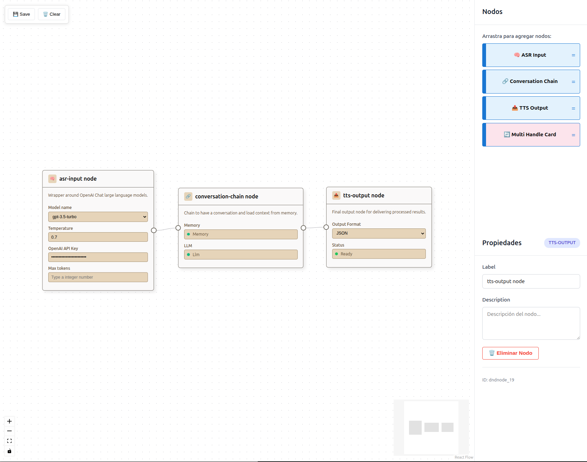

# Workflow Editor PoC - React Flow / XY Flow



Este proyecto analiza las capacidades, limitaciones y viabilidad técnica de React Flow para construir un editor visual de workflows conversacionales robusto y escalable.

## 📋 Descripción del Proyecto

Este PoC implementa un editor visual de flujos conversacionales con las siguientes características:

- **Editor de nodos visual** con drag & drop
- **Nodos personalizados** para diferentes componentes conversacionales (ASR, LLM, TTS)
- **Panel de propiedades** para configurar nodos seleccionados
- **Paleta de componentes** para agregar nuevos nodos
- **Persistencia local** de flujos (localStorage)
- **Conexiones visuales** entre nodos para definir el flujo conversacional

## 🚀 Instalación y Configuración

### Prerrequisitos

- Node.js 18+
- npm, yarn o pnpm

### Instalación

```bash
# Clonar el repositorio
git clone [URL_DEL_REPOSITORIO]
cd workflow-poc-reactflow-xyflow

# Instalar dependencias
npm install
# o
yarn install
# o
pnpm install
```

### Ejecución en Desarrollo

```bash
# Iniciar servidor de desarrollo
npm run dev
# El servidor estará disponible en <http://localhost:5173/>
```

### Comandos Disponibles

```bash
npm run dev      # Servidor de desarrollo
npm run build    # Build de producción
npm run preview  # Vista previa del build
npm run lint     # Análisis de código con ESLint
```

## 🏗️ Arquitectura del Proyecto

```
src/
├── components/          # Componentes UI reutilizables
│   ├── DnDContext/     # Contexto para drag & drop
│   ├── DragCard/       # Tarjetas arrastrables para la paleta
│   └── Sidebar/        # Panel lateral con paleta y propiedades
├── reactflow/          # Configuración específica de React Flow
│   ├── nodes/          # Definición de nodos personalizados
│   │   ├── ConversationalNodes.tsx
│   │   ├── MultiHandleCard.tsx
│   │   ├── types.ts
│   │   └── index.ts
│   └── edges/          # Configuración de conexiones
├── hooks/              # React hooks personalizados
│   └── useDnd.ts      # Hook para drag & drop
├── types/              # Definiciones de tipos TypeScript
└── App.tsx            # Componente principal
```
---

## ⚠️ Riesgos identificados
[Analysis Documentation](./docs/analysis.md)

## 📚 Recursos y Referencias

- [React Flow Documentation](https://reactflow.dev/learn)
- [React Flow API reference](https://reactflow.dev/api-reference/react-flow)
- [React Flow Examples](https://reactflow.dev/examples)
- [React Flow Playground](https://play.reactflow.dev/)